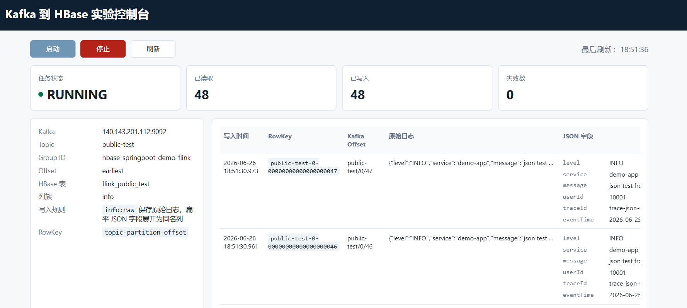

# 从日志到 HBase：用 Flume、Kafka、Flink 串起一条实时数据链路

> 面向读者：刚接触大数据组件的 Java 程序员。  
> 配套项目：[redants-101/hbase-springboot-demo](https://github.com/redants-101/hbase-springboot-demo)。  
> 本文目标：在上一篇《低配服务器上 HBase 从部署到 Java 访问完整指南》的基础上，把链路继续往前推进，完成 `log -> Flume -> Kafka -> Flink -> HBase` 的完整实验闭环。

## 阅读前先准备这些资料

建议先把代码仓库和前置资料打开。本文不会重复展开 HBase、Kafka、Flume 的完整安装过程，而是重点讲它们如何组成一条实时链路，以及当前项目里的 Flink 代码如何承接这条链路。

| 资料 | 作用 |
| --- | --- |
| GitHub 项目：[redants-101/hbase-springboot-demo](https://github.com/redants-101/hbase-springboot-demo) | 本文对应的示例代码仓库 |
| 上一篇文章：[低配服务器上 HBase 从部署到 Java 访问完整指南](https://zhuanlan.zhihu.com/p/2050858006309516584) | 先理解 HBase 部署、远程访问和 Java 客户端 |
| [仓库内 HBase 教程原文](https://github.com/redants-101/hbase-springboot-demo/blob/main/docs/低配服务器上%20HBase%20从部署到%20Java%20访问完整指南.md) | 当前仓库内的 HBase 教程原文 |
| [Apache Flume 安装配置教程](https://github.com/redants-101/hbase-springboot-demo/blob/main/docs/Apache-Flume-安装配置教程.md) | Flume 安装、systemd 管理、Exec Source + Kafka Sink 配置 |
| [Docker 安装 Kafka 单节点教程](https://github.com/redants-101/hbase-springboot-demo/blob/main/docs/Docker安装Kafka单节点教程.md) | Docker 单节点 Kafka 部署、topic、生产消费测试 |
| [Kafka -> Flink -> HBase 核心代码目录](https://github.com/redants-101/hbase-springboot-demo/tree/main/src/main/java/com/example/hbase/flink) | 当前项目中 Kafka -> Flink -> HBase 的核心代码 |
| [可视化实验页面 pipeline.html](https://github.com/redants-101/hbase-springboot-demo/blob/main/src/main/resources/static/pipeline.html) | 当前项目的可视化实验页面 |

如果你还没有跑通过 HBase，先读上一篇 HBase 文章。
如果你还没有部署 Kafka 和 Flume，先按对应安装资料完成基础环境。
本文默认你已经至少知道：HBase 能访问，Kafka 能收到 Flume 写入的 `public-test` 消息。

---

上一篇文章已经解决了一个问题：Java 程序如何连接 HBase，并完成建表、写入、查询、扫描和删除。

但真实业务里，数据通常不是由你手动调用接口写入 HBase 的。更常见的情况是：

```text
应用不断产生日志
日志先被采集
再进入消息队列
然后由实时计算任务消费、清洗、转换
最后落到存储系统中供查询和分析
```

这就是本文要补上的部分。

下面先从整体链路开始，再逐步拆到 Flume、Kafka、Flink、HBase 和当前项目代码。

---

## 1. 这条链路要解决什么问题

我们要实现的是：

```text
/var/log/demo/app.log
  -> Flume
  -> Kafka topic: public-test
  -> Flink
  -> HBase table: flink_public_test
```

你可以先用一句话记住每个组件的职责：

| 组件 | 职责 | 在本文中的角色 |
| --- | --- | --- |
| 日志文件 | 原始数据来源 | `/var/log/demo/app.log` |
| Flume | 采集日志 | 监听日志文件，将新行推到 Kafka |
| Kafka | 缓冲和解耦 | 保存 `public-test` topic 中的日志消息 |
| Flink | 实时处理 | 持续消费 Kafka，并把消息写入 HBase |
| HBase | 存储和查询 | 保存原始日志、Kafka 元信息和 JSON 字段 |
| Spring Boot 页面 | 实验控制台 | 启动、停止、观察这条链路 |

如果不用 Kafka，Flume 可以直接写 HBase。但这样会把采集系统和存储系统耦合得太紧。中间加 Kafka 后，链路变成：

```text
采集归采集
缓冲归缓冲
计算归计算
存储归存储
```

这也是生产环境中常见的数据链路设计思路。

---

## 2. 先把四个核心概念讲清楚

### 2.1 Flume：日志采集器

Flume 的结构是：

```text
Source -> Channel -> Sink
```

在这条链路里：

```text
Exec Source
  -> Memory Channel
  -> Kafka Sink
```

配置重点是：

```properties
a1.sources.r1.type = exec
a1.sources.r1.command = tail -F /var/log/demo/app.log
a1.sinks.k1.type = org.apache.flume.sink.kafka.KafkaSink
a1.sinks.k1.kafka.topic = public-test
a1.sinks.k1.kafka.bootstrap.servers = 140.143.201.112:9092
a1.sinks.k1.useFlumeEventFormat = false
```

其中最容易忽略的是：

```properties
a1.sinks.k1.useFlumeEventFormat = false
```

如果不关闭 Flume 事件格式，Kafka 消费端可能看到不是你原始写入的那一行文本，而是被 Flume 包装过的二进制格式。对本文这种“日志一行就是一条 Kafka 消息”的实验，应该关闭它。

### 2.2 Kafka：消息缓冲层

Kafka 可以先理解为一个高性能消息队列。

本文使用：

```text
bootstrap server: 140.143.201.112:9092
topic: public-test
```

几个基本概念需要掌握：

| 概念 | 含义 |
| --- | --- |
| Broker | Kafka 服务节点 |
| Topic | 消息分类，本文是 `public-test` |
| Partition | Topic 内部的分区 |
| Offset | 消息在某个 Partition 里的序号 |
| Consumer Group | 消费者组，用来记录消费进度 |

Flink 消费 Kafka 时，最关键的是 `group.id`。如果两个 Flink Job 使用同一个 group id 消费同一个 topic，它们会分摊消息；如果希望两个 Job 都完整消费同一份数据，必须使用不同的 group id。

### 2.3 Flink：实时计算引擎

Flink 在本文里做的事很简单：

```text
从 Kafka 读一条日志
转成 Java 对象
解析 JSON 字段
写入 HBase
```

但它的价值不只是“搬运数据”。Flink 真正适合做的是持续运行的流处理任务，例如：

```text
实时清洗
实时聚合
异常检测
字段补全
按窗口统计
写入多种下游存储
```

当前项目为了降低实验门槛，把 Flink Job 嵌入在 Spring Boot 进程里运行。页面点“启动”后，Spring Boot 在本 JVM 内启动一个 Flink 任务。这适合学习验证，不是生产形态。

### 2.4 HBase：面向大规模数据的宽表存储

HBase 的数据结构可以先记成：

```text
Table
  -> RowKey
    -> ColumnFamily
      -> Qualifier
        -> Value
```

本文写入：

```text
Table: flink_public_test
ColumnFamily: info
```

每条 Kafka 消息会写成 HBase 的一行。RowKey 规则是：

```text
topic-partition-offset
```

例如：

```text
public-test-0-00000000000000000047
```

这个 RowKey 的好处是天然幂等。同一条 Kafka 消息如果因为重启、失败恢复被再次写入，它仍然写到同一行，HBase 的 Put 会覆盖旧值，而不是插入重复行。

---

## 3. 当前项目中的代码结构

项目里和这条链路直接相关的代码在：

```text
src/main/java/com/example/hbase/flink
src/main/resources/static/pipeline.html
src/main/resources/application.yml
```

核心文件如下：

| 文件 | 作用 |
| --- | --- |
| `KafkaToHBasePipelineProperties` | 从 `application.yml` 读取 Kafka、HBase、Flink 配置 |
| `KafkaToHBasePipelineController` | 提供启动、停止、查询状态的 REST 接口 |
| `KafkaToHBasePipelineService` | 管理 Flink 作业生命周期和页面指标 |
| `KafkaToHBaseFlinkJob` | 构建 Flink 流图：KafkaSource -> HBaseSink |
| `KafkaRecordToLogEventDeserializer` | 把 Kafka 原始字节消息转成 Java 对象 |
| `KafkaToHBaseSinkFunction` | 把每条消息写入 HBase |
| `KafkaLogEvent` | Kafka 消息在程序里的中间对象 |
| `KafkaToHBasePipelineStatus` | 页面状态接口返回的数据结构 |
| `KafkaToHBasePreviewRow` | 页面展示最近写入记录的数据结构 |
| `pipeline.html` | 页面控制台 |

你可以按下面的调用链读代码：

```text
pipeline.html
  -> KafkaToHBasePipelineController
  -> KafkaToHBasePipelineService
  -> KafkaToHBaseFlinkJob
  -> KafkaRecordToLogEventDeserializer
  -> KafkaToHBaseSinkFunction
  -> HBase
```

这个顺序就是一次“点击启动并写入数据”的真实执行顺序。

---

## 4. 当前项目如何配置这条链路

核心配置在 `application.yml`：

```yaml
pipeline:
  kafka-to-hbase:
    bootstrap-servers: ${PIPELINE_KAFKA_BOOTSTRAP_SERVERS:140.143.201.112:9092}
    topic: ${PIPELINE_KAFKA_TOPIC:public-test}
    group-id: ${PIPELINE_KAFKA_GROUP_ID:hbase-springboot-demo-flink}
    start-from-earliest: ${PIPELINE_KAFKA_START_FROM_EARLIEST:true}
    hbase-table: ${PIPELINE_HBASE_TABLE:flink_public_test}
    column-family: ${PIPELINE_HBASE_CF:info}
    parallelism: ${PIPELINE_FLINK_PARALLELISM:1}
    auto-create-table: ${PIPELINE_AUTO_CREATE_TABLE:true}
    preview-size: ${PIPELINE_PREVIEW_SIZE:20}
    checkpoint-interval-ms: ${PIPELINE_CHECKPOINT_INTERVAL:30000}
    min-pause-between-checkpoints-ms: ${PIPELINE_CHECKPOINT_MIN_PAUSE:15000}
    checkpoint-timeout-ms: ${PIPELINE_CHECKPOINT_TIMEOUT:600000}
```

初学阶段重点看前六项：

```text
bootstrap-servers
topic
group-id
start-from-earliest
hbase-table
column-family
```

`start-from-earliest=true` 表示第一次消费时尽量从 topic 最早消息开始读。实验时很方便，因为你可以看到历史测试消息。生产环境通常要谨慎设置，避免上线后一次性回放大量历史数据。

---

## 5. 数据是如何从 Kafka 写入 HBase 的

Flink Job 中最核心的代码可以概括成：

```java
env.fromSource(source, WatermarkStrategy.noWatermarks(), "Kafka public-test")
   .addSink(new KafkaToHBaseSinkFunction(...));
```

这表示：

```text
KafkaSource 负责读取 Kafka
KafkaToHBaseSinkFunction 负责写 HBase
```

Kafka 中的一条消息进入 Flink 后，先经过 `KafkaRecordToLogEventDeserializer`：

```text
byte[] value
  -> UTF-8 字符串
  -> KafkaLogEvent(topic, partition, offset, timestamp, value)
```

然后进入 HBase Sink。Sink 做几件事：

1. 生成 RowKey。
2. 写入原始消息到 `info:raw`。
3. 写入 Kafka 元信息到 `info:kafka_topic`、`info:kafka_partition`、`info:kafka_offset`、`info:kafka_timestamp`。
4. 尝试解析 JSON。
5. 如果 JSON 解析成功，把第一层字段展开成 HBase 列。
6. 调用 `table.put(put)` 写入 HBase。

如果写入的是普通文本：

```text
Hello Flume, this is a test log!
```

HBase 中主要会看到：

```text
info:raw = Hello Flume, this is a test log!
```

如果写入的是 JSON：

```json
{"level":"INFO","service":"demo-app","message":"json test from flume","userId":"10001"}
```

HBase 中会看到：

```text
info:raw     = 原始 JSON 字符串
info:level   = INFO
info:service = demo-app
info:message = json test from flume
info:userId  = 10001
```

这个设计适合入门学习：既保留原始数据，又能在 HBase 中按字段观察解析结果。

---

## 6. 如何手动跑通完整链路

先确认 Flume 和 Kafka 已经在云服务器上运行。Flume 监听：

```text
/var/log/demo/app.log
```

Kafka topic 是：

```text
public-test
```

本地启动当前项目：

```powershell
mvn spring-boot:run
```

打开页面：

```text
http://localhost:8080/pipeline.html
```

页面运行效果如下：



点击“启动”。状态应变成：

```text
RUNNING
```

然后在云服务器写一条 JSON 日志：

```bash
echo "{\"level\":\"INFO\",\"service\":\"demo-app\",\"message\":\"log to hbase\",\"userId\":\"10001\",\"traceId\":\"trace-$(date +%s)\",\"eventTime\":\"$(date '+%Y-%m-%d %H:%M:%S')\"}" >> /var/log/demo/app.log
```

页面应该看到：

```text
已读取 +1
已写入 +1
最近写入预览出现 JSON 字段
```

HBase Shell 可以验证：

```ruby
scan 'flink_public_test', {LIMIT => 10}
```

如果页面已写入增加，但 HBase 查不到，优先确认你查的是同一个 HBase 集群和同一张表。

---

## 7. 生产环境中 Flink 通常怎么使用

当前项目的嵌入式 Flink 只适合学习。生产环境不应该让 Spring Boot 长期承载 Flink 作业。

生产形态通常是：

```text
Spring Boot 管理页面
  -> 提交 Flink Job
  -> 查询 Job 状态
  -> 停止 Job

Flink 集群
  -> 长期运行 Kafka -> HBase 作业
```

也就是说：

```text
Spring Boot 负责管理
Flink 集群负责计算
Kafka 负责缓冲
HBase 负责存储
```

Flink 集群一般有这些部署方式：

| 模式 | 适合场景 |
| --- | --- |
| Standalone | 学习、单机实验、小规模内部任务 |
| YARN | 已经有 Hadoop/YARN 集群的公司 |
| Kubernetes | 云原生生产环境 |

对这条学习链路，建议先从 Standalone 单机集群开始。它比嵌入式 Flink 更接近真实使用方式，也比 YARN、Kubernetes 简单。

生产环境还需要考虑：

| 问题 | 说明 |
| --- | --- |
| Checkpoint 存储 | 不能只放本地临时目录，应该放 HDFS、对象存储或可靠共享存储 |
| Savepoint | 用于升级、停止、恢复作业 |
| Kafka group id | 每个独立作业要规划好消费组，避免互相抢分区 |
| HBase RowKey | 要根据查询场景设计，避免热点 |
| 幂等写入 | 当前 `topic-partition-offset` RowKey 可以降低重复写入影响 |
| 监控告警 | 要关注 Flink 失败重启、Kafka lag、HBase 写入延迟 |
| 资源隔离 | 多个 Job 不能无限抢同一台机器的 CPU、内存和 slot |

如果后续把当前项目改成 Standalone Flink 集群，建议做三件事：

1. 抽出一个带 `main` 方法的独立 Flink Job。
2. 打一个 Flink 专用 fat jar，不要直接提交 Spring Boot 可执行 jar。
3. Spring Boot 页面改成调用 Flink REST API 提交、停止、查询 Job。

多个 Job 的本质是：

```text
同一个 Flink jar 多次提交
每次传不同参数
```

例如不同 topic、不同 group id、不同 HBase 表。

---

## 8. 常见问题排查

### 8.1 Kafka 能看到消息，但页面已读取为 0

这说明：

```text
Flume -> Kafka 成功
Kafka -> Flink 失败
```

优先检查：

```text
本地或 Flink 所在机器能否访问 140.143.201.112:9092
Kafka advertised.listeners 是否是公网 IP
页面是否已经点击“启动”
是否在启动后又写入了新日志
```

Kafka 在云服务器本机能消费，不代表本地 Spring Boot 或 Flink 集群也能消费。

### 8.2 已读取增加，但已写入不增加

这说明：

```text
Flink 已经读到 Kafka
写 HBase 失败
```

优先看：

```text
页面最近错误
Spring Boot 控制台异常
HBase 表是否存在
列族是否是 info
HBase RegionServer 是否可访问
```

### 8.3 JSON 字段没有展开

当前项目只自动展开第一层 JSON 对象。下面这种可以展开：

```json
{"level":"INFO","message":"hello"}
```

多行 JSON 不适合这个链路，因为 Flume 通常按行采集。嵌套对象会被当成字符串保存，不会递归展开。

### 8.4 第一次启动后突然写入很多数据

通常是因为：

```yaml
start-from-earliest: true
```

它会从历史消息开始消费。只想消费新数据时，改成：

```powershell
$env:PIPELINE_KAFKA_START_FROM_EARLIEST="false"
mvn spring-boot:run
```

---

## 9. 本文和上一篇 HBase 文章的关系

上一篇文章《低配服务器上 HBase 从部署到 Java 访问完整指南》解决的是：

```text
Java 如何连接 HBase
Java 如何操作 HBase 表和数据
HBase 远程访问容易踩哪些坑
```

本文解决的是：

```text
日志如何进入 Kafka
Flink 如何消费 Kafka
Flink 如何把日志写入 HBase
这条实时链路的代码结构如何理解
```

两篇文章合起来就是：

```text
先知道 HBase 怎么部署、怎么连、怎么写
再知道实时日志怎么经过 Flume、Kafka、Flink 写到 HBase
```

完整学习路线建议：

1. 先读 HBase 文章，跑通 HBase 和 Java 访问。
2. 按 Kafka 安装教程启动单节点 Kafka。
3. 按 Flume 教程配置 Exec Source + Kafka Sink。
4. 启动当前项目页面。
5. 从 `/var/log/demo/app.log` 写入 JSON 日志。
6. 看页面和 HBase Shell 中的写入结果。

---

## 10. 延伸资料

本文开头已经给出项目地址和前置资料。读完正文后，建议按下面顺序回看：

1. 看 GitHub 项目，确认代码结构和本文描述一致。
2. 看上一篇 HBase 文章，补齐 HBase 连接、端口和 Java 客户端知识。
3. 看 Kafka 安装资料，重点确认 `advertised.listeners`、`public-test` topic 和生产消费测试。
4. 看 Flume 安装资料，重点确认 `tail -F /var/log/demo/app.log` 和 Kafka Sink。
5. 回到当前项目，重点读 `KafkaToHBaseFlinkJob` 和 `KafkaToHBaseSinkFunction`。

如果你是第一次接触这几个组件，建议不要先追求生产级架构。先把下面这条链路跑通：

```text
echo 写日志
  -> Flume 采集
  -> Kafka 能消费
  -> 页面启动 Flink
  -> HBase scan 能看到数据
```

跑通这条线后，再去学习 Standalone Flink 集群、多个 Job、Checkpoint 存储、Savepoint、Kafka lag 监控和 HBase RowKey 设计。这样学习顺序更稳定，也更容易定位问题。
